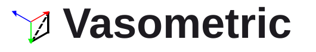

<div align="center">
  
</div>
<p align="right">Isometric and perspective drawing tools for Figma</p>

<div align="center">
  <p>
  <a href="https://github.com/mybna134/Vasometric/releases/latest"></a>
  <a href="https://github.com/mybna134/Vasometric/actions/workflows/release.yml"></a>
  
  
  
  <a href="LICENSE"></a>
  </p>
  <p>
  <a href="README.md"></a>
  <a href="README.en.md"></a>
  </p>
</div>

## Features

- Preview axonometric transforms for selected layers, with direction, angle, and extrusion depth controls. Extrusions can outline the base and add a back face using the source artwork. Both color pickers accept RGBA and 8-digit HEX values with alpha.
- Adjust skew, 3D rotation, camera, extrusion, and shadows in perspective mode.
- Show an isometric cube wireframe behind the preview. Figma layers change only when you click **Apply to selection**.
- The first transform saves each layer's original size and orientation. Select it again and click **Restore original** to restore it in place and remove extrusion layers created by the plugin. **Reset preview** only resets panel settings.

## License

This project is distributed under the [GNU General Public License v3.0 only](LICENSE).

## Install

Download and extract the ZIP from [Releases](https://github.com/mybna134/Vasometric/releases/latest). In Figma, choose **Plugins → Development → Import plugin from manifest…** and select the extracted `manifest.json`.

## Build from source

Install [Bun](https://bun.sh/), then run from the repository root:

```sh
bun ci
bun run build
```

The build creates `dist/code.js` and `dist/ui.html`, which contains the bundled UI script and icon. Figma loads these files from the root `manifest.json`; Git ignores `dist/`.

Run `bun run watch` while editing plugin code. After changing the UI, run `bun run build:ui`. Run `bun run lint` to check the code.

## Automated releases

GitHub Actions builds on pushes and pull requests, then packages `manifest.json`, `dist/code.js`, and `dist/ui.html` into `Vasometric-{version}.zip`. A push to the default branch creates a GitHub Release with the ZIP attached.

Versions use `YYYYMMDDHHMM-<7-character commit hash>` in China Standard Time (Asia/Shanghai). For example, `202609082209-a1b2c3d` identifies a build made at 22:09 on September 8, 2026.
