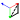

<div align="center">
  <p> </p>
  <p align="right">Figma 等轴测与透视绘图工具</p>
  <p>
  <a href="https://github.com/mybna134/Vasometric/releases/latest"></a>
  <a href="https://github.com/mybna134/Vasometric/actions/workflows/release.yml"></a>
  
  
  
  <p>
  <a href="README.md"></a>
  <a href="README.en.md"></a>
  </p>
  </p>
</div>

## 功能

- 在插件面板中预览所选图层的等轴测变换，调整方向、角度和挤出深度。
- 调整透视模式下的倾斜、3D 旋转、相机、挤出和阴影。
- 在预览中显示等轴测立方体线框网格；点击 **Apply to selection** 后才会修改 Figma 图层。

## 安装

从 [Releases](https://github.com/mybna134/Vasometric/releases/latest) 下载 ZIP 并解压。在 Figma 中选择 **Plugins → Development → Import plugin from manifest…**，打开解压目录中的 `manifest.json`。

## 从源码构建

需要 [Bun](https://bun.sh/)。在仓库根目录运行：

```sh
bun ci
bun run build
```

构建会生成 `dist/code.js` 和内嵌脚本与图标的 `dist/ui.html`。Figma 从仓库根目录的 `manifest.json` 加载这两个文件；`dist/` 已被 Git 忽略。

编辑插件逻辑时可运行 `bun run watch`；修改界面后运行 `bun run build:ui`。代码检查命令为 `bun run lint`。
